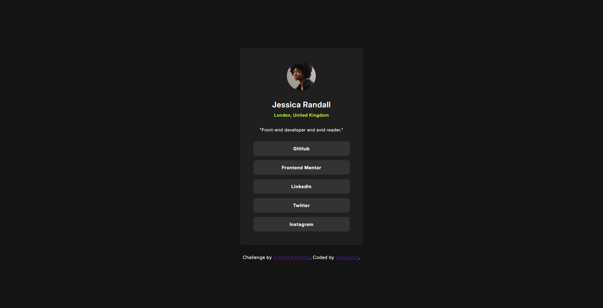

# Frontend Mentor - Social links profile solution

This is a solution to the [Social links profile challenge on Frontend Mentor](https://www.frontendmentor.io/challenges/social-links-profile-UG32l9m6dQ). Frontend Mentor challenges help you improve your coding skills by building realistic projects. 

### Screenshot



### Links

- Solution URL: (https://www.frontendmentor.io/solutions/social-links-profile-solution-01Zr1eL_kB)
- Live Site URL: (https://frontend-challenge-social-links-profile.vercel.app)

### Built with

- Semantic HTML5 markup
- CSS custom properties
- Flexbox

### What I learned

```css
button {
    width: 300px;
    max-width: 100%;
    padding: 14px;
    border: none;
    border-radius: 8px;
    background-color: hsl(0, 0%, 20%);
    color: hsl(0, 0%, 100%);
    font-family: 'Inter', sans-serif;
    font-size: 14px;
    font-weight: 700;
    letter-spacing: 0.9px;
    transition: all 0.3s ease;
}

button:hover {
    cursor: pointer;
    background-color: hsl(75, 94%, 57%);
    color: black;
}

button:active {
    background-color: hsl(0, 0%, 20%);
}
```
